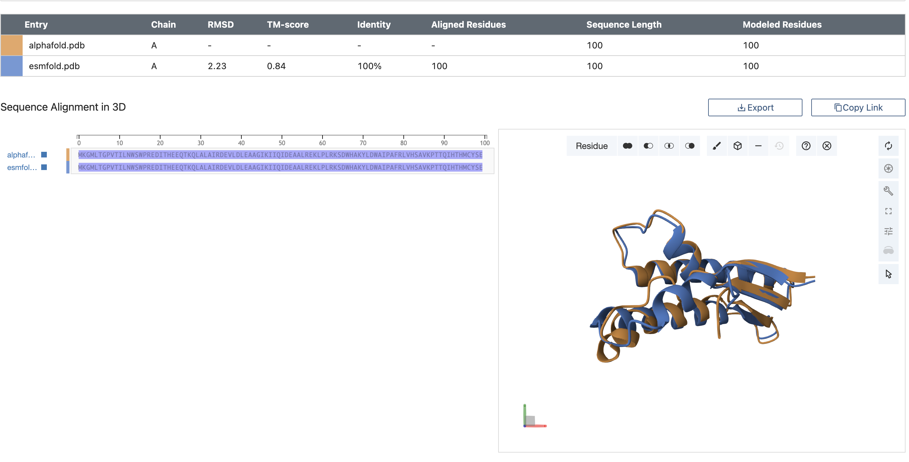
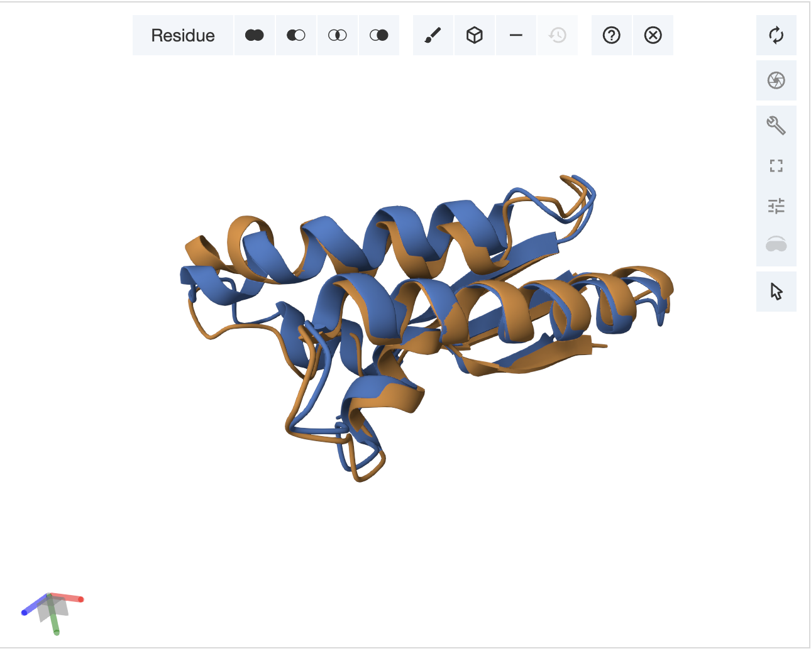

# Задание 5
Метлин Александр 22214
## Исходные данные и программы
Первичная последовательность белка - `MKGMLTGPVTILNWSWPREDITHEEQTKQLALAIRDEVLDLEAAGIKIIQIDEAALREKLPLRKSDWHAKYLDWAIPAFRLVHSAVKPTTQIHTHMCYSE`

Инструменты фолдинга:
- [AlphaFold2](https://colab.research.google.com/github/sokrypton/ColabFold/blob/main/AlphaFold2.ipynb)
- [ESMFold](https://colab.research.google.com/github/sokrypton/ColabFold/blob/main/ESMFold.ipynb)
 

Инструмент парного выравнивания - https://www.rcsb.org/alignment

## Выполнение работы
### Предсказание
- [Результат](./ESMFold_model) для ESMFold_model
  - [PDB-файл](./ESMFold_model/esmfold.pdb)

- [Результат](./AlphaFold2/) для AlphaFold2
  - [PDB-файл](./AlphaFold2/alphafold.pdb)

### Парное выравнивание

[Файл выравнивания](./pairwise/sequence_alignment_2025-11-21-21-55-2.fasta)

### визуализация
взял с сайта где делал, так как после обновления новой макоси старая программа визулизации перестала нормально работать.

### Выводы
Предсказания структур AlphaFold2 и ESMFold пересекаются на 100% и имеют высокий показатель идентичности последовательности и TM-score, что указывает на практически полное совпадение моделей. Вероятнее всего это связано с тем, что структура данного белка уже имеется в общедоступных базах данных, на которых обучались предсказатели.

Однако при визуализации можно заметить, что расположение цепочек немного отличается, что отражается в среднем квадратичном отклонении (RMSD = 2.23 Å). Это небольшое различие наблюдается преимущественно в гибких петлях и концевых участках белка, в то время как ядро структуры полностью совпадает.