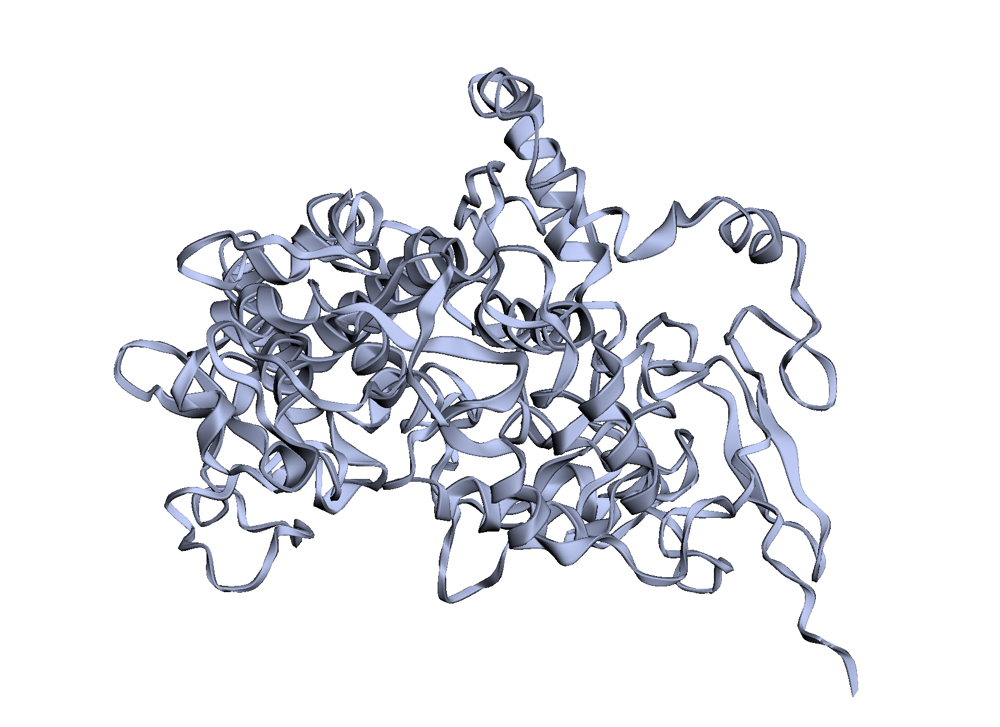
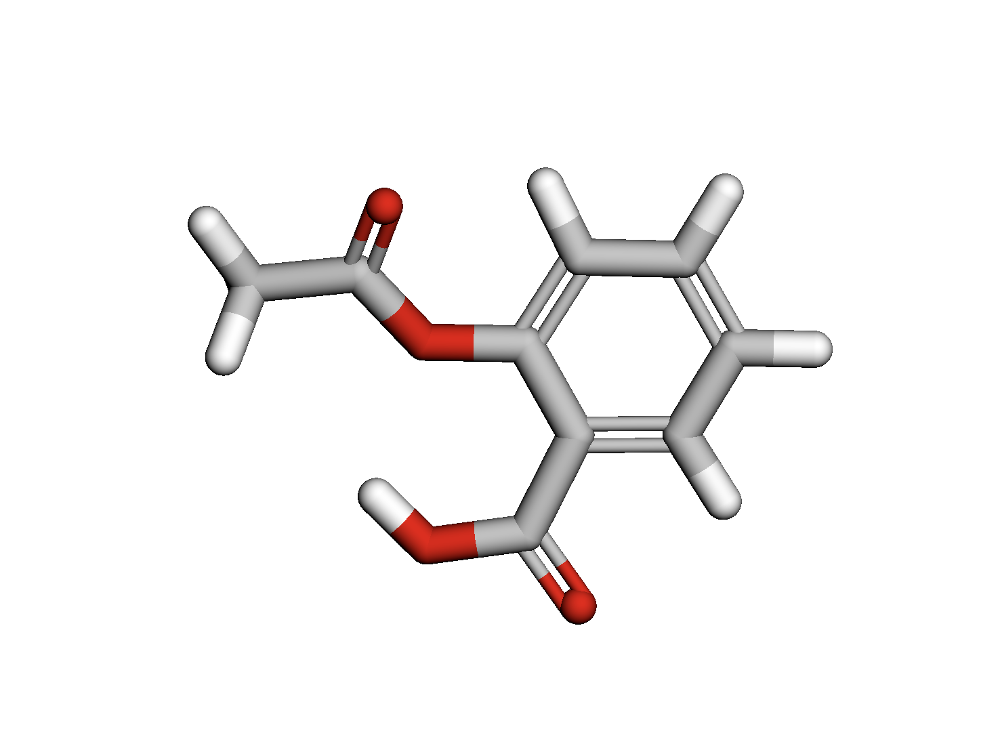
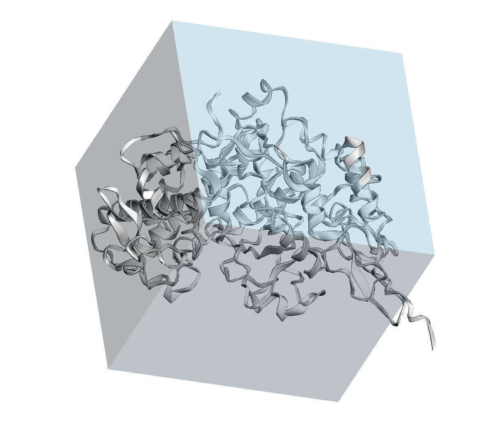
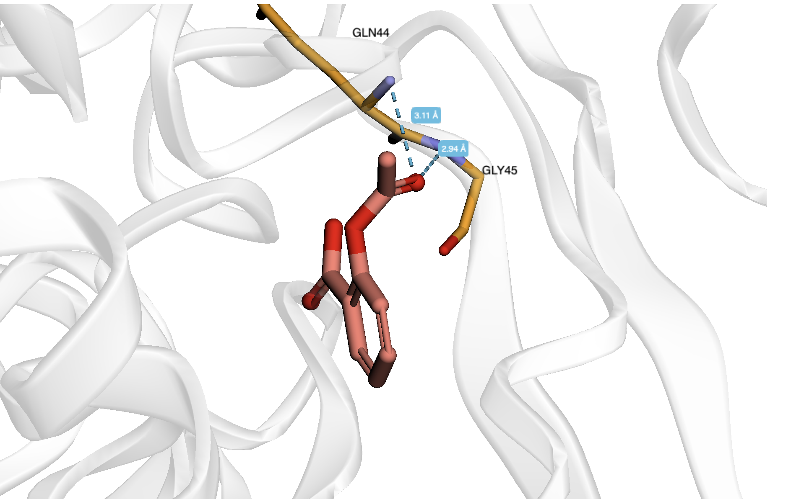

# Задание 6  
## Докинг лекарственных молекул

**Метлин Александр**  
Группа: **22214**

---

## Исходные данные и программы

- **Лиганд:** Aspirin  
- **SMILES:** `CC(=O)OC1=CC=CC=C1C(O)=O`  
- **Таргет:** Cyclooxygenase-1 (COX-1)  
- **PDB ID:** 6Y3C  

---

## Выполнение работы

### 1. Информация о препарате (лиганде)

#### a. Действующее вещество

**Аспирин** — международное непатентованное название:  
**Ацетилсалициловая кислота** (*Acetylsalicylic acid*).

- Химическая формула: **C₉H₈O₄**
- Молекулярная масса: **≈ 180.16 г/моль**

---

#### b. Область применения

Ацетилсалициловая кислота применяется в медицинской практике как:
- анальгетик (обезболивающее средство),
- антипиретик (жаропонижающее средство),
- противовоспалительное средство,
- антиагрегант (в малых дозах — для профилактики тромбообразования).

---

#### c. Молекулярный механизм действия

Аспирин **необратимо ингибирует фермент циклооксигеназу-1 (COX-1)**, ацетилируя сериновый остаток в активном центре фермента.

В результате:
- блокируется превращение арахидоновой кислоты в простагландины и тромбоксаны;
- снижается воспаление, болевая чувствительность и агрегация тромбоцитов.

Ингибирование COX-1 является **ковалентным и необратимым**, что отличает аспирин от большинства других нестероидных противовоспалительных препаратов (НПВС).

## Докинг

Все резы в папке *Aspirin*

Трехмерная структура таргета:

Трехмерная структура Лиганда:

Бокс для докинга

Докинг
Aspirin 1

Aspirin 5
